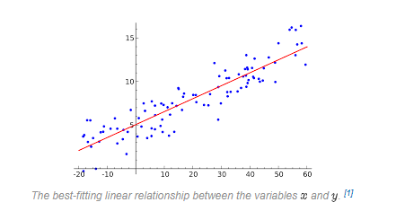
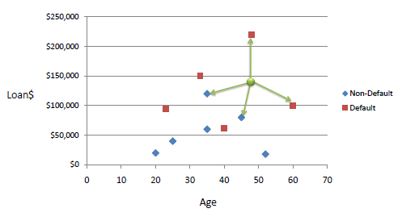

# Python_MachineLearningMethods

## 1. Linear Regression Method

Linear Regression is used to measure the relationship between two variables. It is considered the basis of machine learning algorithms. The aim is to obtain the closest linear result to the connection between these two variables.

As one variable increases, another variable increases, and the phenomenon of establishing a relationship between the two has occurred in linear regression.

One of the goals is to find the linear function that expresses the relationship between the dependent and independent variable. Making predictions from data at the base of machine learning is also valid for linear regression.

If we look at the linear regression mathematical formula;

## 2. (KNN) K-Nearest Neighbours Method

It is expressed as the classification of the data of unknown class by assigning the data to the most ideal (optimal) class according to the distance calculated as a result of a distance measurement by comparing it with the other data in the training set. 

A K value is determined in the operation of the algorithm. This K value means the number of elements to look at. When a value comes, the distance between the incoming value is calculated by taking the nearest K element. Euclidean, Manhattan, Minkowski and Hamming functions are used in distance calculation.
